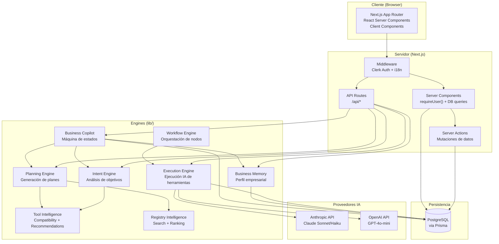
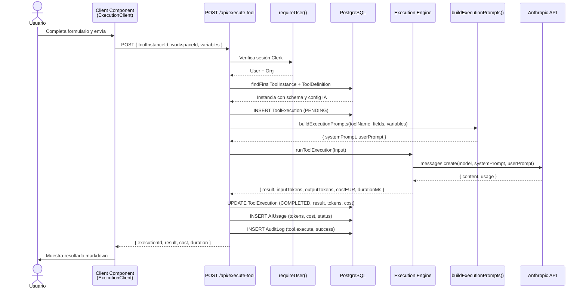
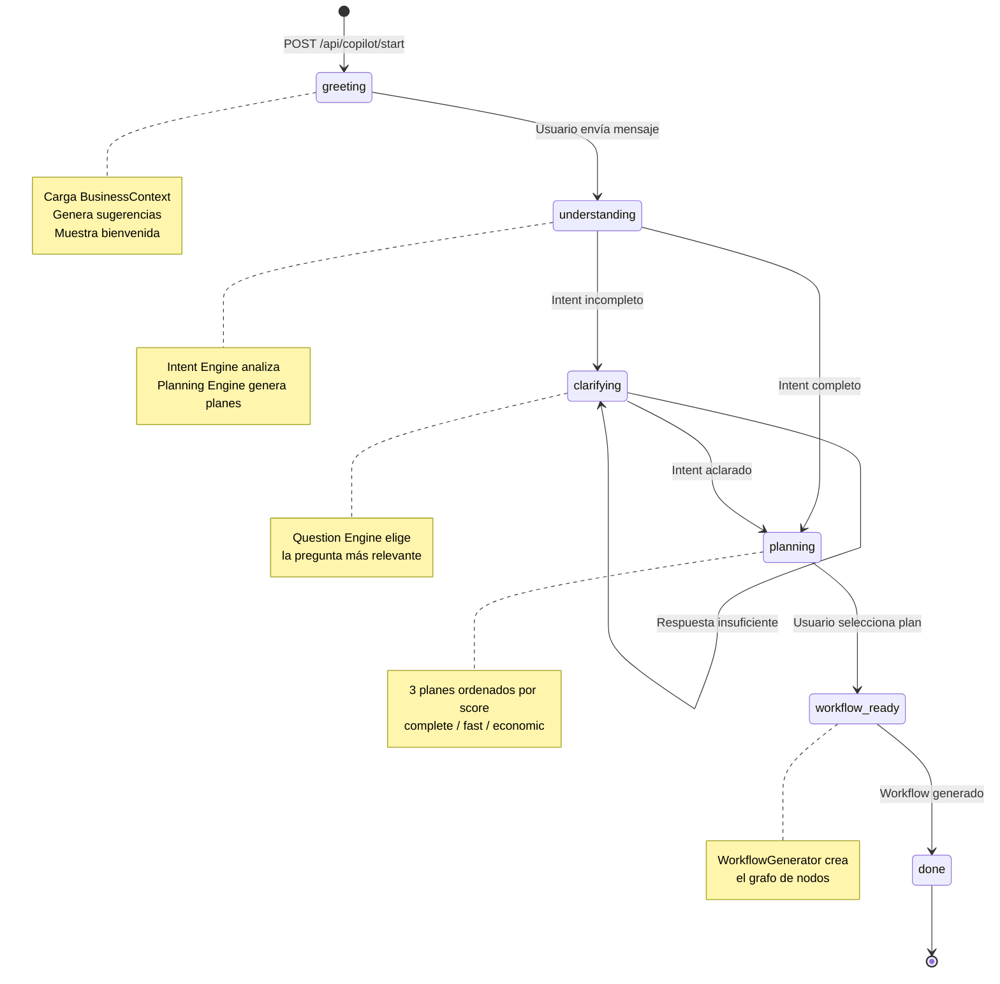
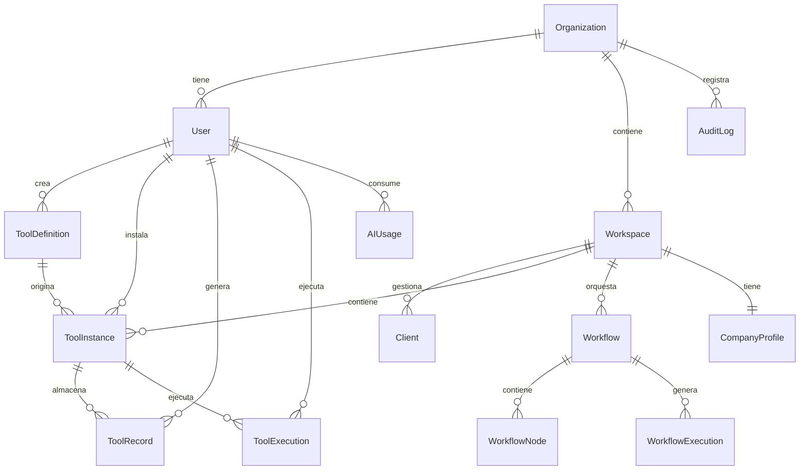
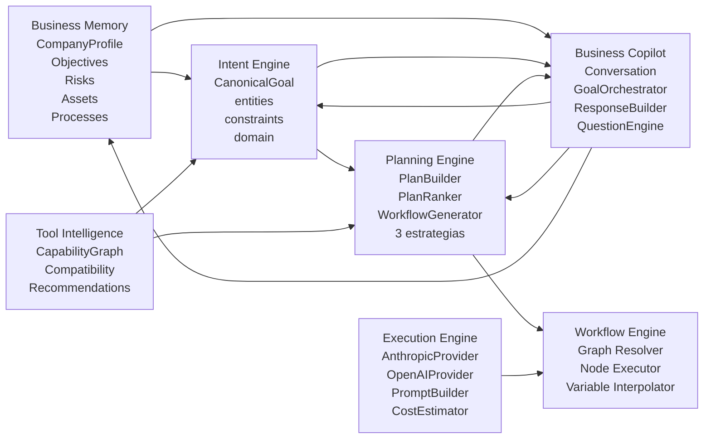

# ProTools Hub — Documentación Oficial

## Documento 02 — Arquitectura General

---

**Versión del documento:** 1.0  
**Fecha:** 2026-06-29  
**Estado:** Publicado

---

## Tabla de Contenidos

1. [Stack Tecnológico](#1-stack-tecnológico)
2. [Arquitectura Global](#2-arquitectura-global)
3. [Estructura del Monorepo](#3-estructura-del-monorepo)
4. [Capas de la Aplicación](#4-capas-de-la-aplicación)
5. [Flujo Completo de una Ejecución](#5-flujo-completo-de-una-ejecución)
6. [Flujo del Business Copilot](#6-flujo-del-business-copilot)
7. [Modelo Multi-tenant](#7-modelo-multi-tenant)
8. [Componentes y Relaciones](#8-componentes-y-relaciones)
9. [Decisiones de Arquitectura (ADRs)](#9-decisiones-de-arquitectura-adrs)

---

## 1. Stack Tecnológico

| Capa | Tecnología | Versión | Rol |
|---|---|---|---|
| **Framework** | Next.js | 15.x | App Router, RSC, API Routes, Server Actions |
| **Lenguaje** | TypeScript | 5.x | Tipado estricto end-to-end |
| **Base de datos** | PostgreSQL | 16.x | Almacenamiento principal |
| **ORM** | Prisma | 6.19.3 | Acceso a datos, schema, migraciones |
| **Auth** | Clerk | v6 | Autenticación, organizaciones, webhooks |
| **IA Principal** | Anthropic Claude | SDK | Ejecución de herramientas y generación |
| **IA Alternativa** | OpenAI GPT | SDK | Provider secundario configurable |
| **UI Framework** | React | 18.x | Componentes del cliente |
| **Estilos** | Tailwind CSS | 3.x | Sistema de diseño utility-first |
| **Workflow Canvas** | React Flow | — | Editor visual de workflows |
| **Monorepo** | Turborepo | 2.x | Build orchestration, caching |
| **Package Manager** | npm workspaces | — | Gestión de dependencias |
| **Build** | Next.js Turbopack | — | Compilación dev en modo rápido |
| **Despliegue** | Vercel (previsto) | — | Edge Functions, CDN |

---

## 2. Arquitectura Global



---

## 3. Estructura del Monorepo

```
protools-hub/
├── apps/
│   └── web/                        ← Aplicación Next.js principal
│       ├── src/
│       │   ├── app/                ← App Router (páginas + API routes)
│       │   │   ├── (auth)/         ← Páginas de auth (sign-in, sign-up)
│       │   │   ├── (dashboard)/    ← Páginas autenticadas
│       │   │   │   ├── layout.tsx  ← Layout raíz del dashboard
│       │   │   │   ├── org/        ← Panel de organización
│       │   │   │   └── workspace/
│       │   │   │       └── [workspaceId]/
│       │   │   │           ├── layout.tsx        ← WorkspaceShell
│       │   │   │           ├── page.tsx          ← Dashboard
│       │   │   │           ├── analytics/
│       │   │   │           ├── audit/
│       │   │   │           ├── clients/
│       │   │   │           ├── copilot/
│       │   │   │           ├── generate/
│       │   │   │           ├── import/
│       │   │   │           ├── tools/
│       │   │   │           ├── usage/
│       │   │   │           └── workflows/
│       │   │   ├── api/            ← API Routes
│       │   │   │   ├── copilot/    ← start, message, select-plan, suggestions
│       │   │   │   ├── execute-tool/
│       │   │   │   ├── generate-tool/
│       │   │   │   ├── import/
│       │   │   │   ├── intent/
│       │   │   │   ├── memory/
│       │   │   │   ├── pdf/
│       │   │   │   ├── plans/
│       │   │   │   ├── tools/
│       │   │   │   ├── webhooks/   ← Clerk webhook
│       │   │   │   └── workflows/
│       │   │   ├── actions/        ← Next.js Server Actions
│       │   │   └── tools/          ← Marketplace (standalone, fuera del dashboard)
│       │   ├── lib/                ← Lógica de negocio y engines
│       │   │   ├── business-copilot/
│       │   │   ├── business-memory/
│       │   │   ├── intent-engine/
│       │   │   ├── planning-engine/
│       │   │   ├── tool-intelligence/
│       │   │   ├── registry-intelligence/
│       │   │   ├── ai-providers/
│       │   │   ├── execution-engine.ts
│       │   │   ├── workflow-engine.ts
│       │   │   ├── audit.ts
│       │   │   ├── auth.ts
│       │   │   ├── db.ts
│       │   │   └── permissions.ts
│       │   ├── registry/           ← Catálogo oficial de herramientas
│       │   │   └── official/       ← +50 herramientas por dominio
│       │   │       ├── audit/
│       │   │       ├── consulting/
│       │   │       ├── hr/
│       │   │       ├── it/
│       │   │       ├── marketing/
│       │   │       ├── purchasing/
│       │   │       ├── quality/
│       │   │       ├── sales/
│       │   │       └── security/
│       │   ├── i18n/               ← Internacionalización (es/en)
│       │   └── middleware.ts        ← Clerk Auth + i18n
│       └── prisma/
│           ├── schema.prisma       ← Fuente de verdad del modelo de datos
│           └── seed.ts             ← Seed del catálogo oficial
├── packages/
│   ├── schema/                     ← ToolSchemaV1 compartido
│   │   └── src/tool-schema.ts
│   ├── import-engine/              ← Importación CSV/Excel/PDF/DOCX/JSON
│   │   └── src/
│   │       ├── parsers/
│   │       ├── converters/
│   │       ├── validators/
│   │       └── pipeline.ts
│   └── ui/                         ← Componentes compartidos (si existieran)
├── turbo.json                      ← Configuración Turborepo
└── package.json
```

---

## 4. Capas de la Aplicación

### 4.1 Capa de Presentación (app/)

**Server Components (RSC):** Renderizan en el servidor. Acceden directamente a la DB via Prisma. Ejecutan `requireUser()` para autenticación. No tienen estado del cliente.

**Client Components:** Interactividad del usuario. Reciben datos del servidor como props. Usan `useState`, `useEffect`, `useTransition`. Ejemplos: `CopilotInterface`, `WorkflowEditor`, `MarketplaceClient`.

**API Routes:** Endpoints HTTP para operaciones que deben ser asíncronas o invocadas desde el cliente. Todos protegidos con `requireUser()`. Retornan JSON.

**Server Actions:** Funciones del servidor invocables directamente desde Client Components. Únicas para mutaciones de datos que no necesitan URL pública.

### 4.2 Capa de Negocio (lib/)

Contiene toda la lógica que no es UI ni persistencia:

| Módulo | Archivo(s) | Responsabilidad |
|---|---|---|
| **Auth** | `auth.ts` | `requireUser()`, `getOptionalUser()`, `requireRole()` |
| **Permisos** | `permissions.ts` | `can()`, `assertCan()`, `roleAtLeast()` |
| **Audit** | `audit.ts` | `audit()`, `auditDenied()` — fire-and-forget |
| **DB** | `db.ts` | Singleton Prisma Client |
| **Execution Engine** | `execution-engine.ts` | Orquestación de providers IA |
| **Workflow Engine** | `workflow-engine.ts` | Ejecución secuencial de nodos |
| **AI Cost** | `ai-cost.ts` | `estimateCostEUR()` por modelo |
| **Providers** | `ai-providers/` | OpenAI, extensible a otros |
| **Intent Engine** | `intent-engine/` | Análisis de objetivos en LN |
| **Planning Engine** | `planning-engine/` | Generación de planes estratégicos |
| **Business Memory** | `business-memory/` | Perfil empresa, contexto, actualizaciones |
| **Business Copilot** | `business-copilot/` | Máquina de estados del copilot |
| **Tool Intelligence** | `tool-intelligence/` | Compatibilidad y recomendaciones |
| **Registry Intelligence** | `registry-intelligence/` | Búsqueda y ranking del catálogo |

### 4.3 Capa de Persistencia (Prisma + PostgreSQL)

Un único `PrismaClient` singleton en `lib/db.ts`:

```typescript
// lib/db.ts
import { PrismaClient } from '@prisma/client'
declare global { var prisma: PrismaClient | undefined }
export const db = globalThis.prisma ?? new PrismaClient()
if (process.env.NODE_ENV !== 'production') globalThis.prisma = db
```

El schema tiene 25 modelos organizados en 6 dominios. Ver [Doc 03 — Base de Datos].

### 4.4 Capa de Registry (registry/official/)

El catálogo de herramientas oficiales vive como código TypeScript. Cada herramienta es un objeto que define:
- Metadatos del marketplace (`ToolRegistryMeta`)
- Perfil de capacidades (`ToolCapabilityProfile`)
- Schema completo (`ToolSchemaV1`)

Se sincroniza con la base de datos mediante el seed (`prisma/seed.ts`).

---

## 5. Flujo Completo de una Ejecución



---

## 6. Flujo del Business Copilot



---

## 7. Modelo Multi-tenant



**Aislamiento de datos:** Toda query que accede a datos de un workspace incluye el filtro `orgId: user.orgId`. Esto garantiza que un usuario de la Org A nunca accede a datos de la Org B aunque conozca un ID.

---

## 8. Componentes y Relaciones

### 8.1 Mapa de Engines



### 8.2 Flujo de Datos entre Engines

1. **BusinessContext** (desde Business Memory) → enriquece análisis de Intent Engine
2. **IntentResult** (desde Intent Engine) → alimenta Planning Engine y Question Engine
3. **ExecutionPlan** (desde Planning Engine) → alimenta WorkflowGenerator y CopilotInterface
4. **GeneratedWorkflow** (desde WorkflowGenerator) → se guarda en DB para ejecución
5. **ToolExecution results** → actualizan BusinessMemoryLog automáticamente

---

## 9. Decisiones de Arquitectura (ADRs)

### ADR-001: App Router de Next.js 15

**Decisión:** Usar App Router con React Server Components en lugar de Pages Router.

**Razones:**
- Los RSC permiten acceso directo a DB sin API intermedia para reads
- El layout anidado facilita el WorkspaceShell
- Los Server Actions simplifican mutaciones
- El caching de RSC mejora rendimiento

**Consecuencias:** Las páginas son async por defecto. Los Client Components deben marcarse explícitamente con `'use client'`.

---

### ADR-002: Prisma sobre Drizzle o SQL puro

**Decisión:** Usar Prisma 6 como ORM.

**Razones:**
- Schema declarativo como fuente de verdad
- Tipos TypeScript generados automáticamente
- `prisma db push` para desarrollo rápido sin migraciones
- Relaciones type-safe en queries

**Consecuencias:** No se crean archivos de migración (`db push`). Actualizaciones del schema requieren coordinación con el equipo.

---

### ADR-003: Clerk para Autenticación

**Decisión:** Usar Clerk v6 en lugar de NextAuth o Auth.js.

**Razones:**
- Organizaciones multi-tenant gestionadas
- Webhook para sincronizar usuarios
- SSO/SAML preparado para Enterprise
- Dashboard de usuarios sin código adicional

**Consecuencias:** El `clerkId` es la clave foránea que conecta Clerk con el modelo `User` de Prisma.

---

### ADR-004: ToolSchemaV1 como JSON en PostgreSQL

**Decisión:** Almacenar el schema completo de cada herramienta como `Json` en PostgreSQL en lugar de tablas relacionales.

**Razones:**
- La estructura de un schema varía enormemente entre herramientas
- Evita el problema del EAV (Entity-Attribute-Value) con sus problemas de tipado
- Validación al insertar con `validateToolSchema()`
- El schema es un documento autocontenido

**Consecuencias:** Los campos individuales del schema no son consultables con SQL estándar. Las queries de búsqueda en metadatos se hacen a través de `ToolRegistryMeta`.

---

### ADR-005: Separación ToolRegistryMeta / ToolCapabilityProfile

**Decisión:** Separar los metadatos del marketplace de los metadatos de inteligencia en dos tablas distintas.

**Razones:**
- Single Responsibility Principle: presentación vs. inteligencia
- `ToolRegistryMeta` puede cambiar sin afectar al Planning Engine
- `ToolCapabilityProfile` puede actualizarse sin cambiar el marketplace
- Permite cargar solo lo que necesita cada engine

**Consecuencias:** Se requieren dos registros al crear una herramienta oficial. El seed maneja esta dualidad.

---

### ADR-006: Audit como Fire-and-Forget

**Decisión:** El `audit()` nunca lanza excepciones ni bloquea el flujo principal.

**Razones:**
- Un error de escritura en el audit log no debe romper la operación de negocio
- El audit es observabilidad, no parte crítica del flujo
- PostgreSQL tiene alta disponibilidad; los errores son raros

**Consecuencias:** Es posible (improbable) perder eventos de audit en caso de fallo de DB. Este trade-off es aceptable para el MVP.

---

### ADR-007: Business Memory sin LLM en el Copilot

**Decisión:** El Business Copilot no usa IA para construir el `BusinessContext`. Lo lee directamente de la DB.

**Razones:**
- El contexto ya está estructurado en `CompanyProfile`, `CompanyObjective`, etc.
- Eliminar la llamada LLM reduce latencia y coste
- El `BusinessContext` es determinista y trazable

**Consecuencias:** El contexto solo incluye lo que el sistema ha aprendido explícitamente. Información no estructurada del usuario (en mensajes) no actualiza el perfil automáticamente en el MVP.
