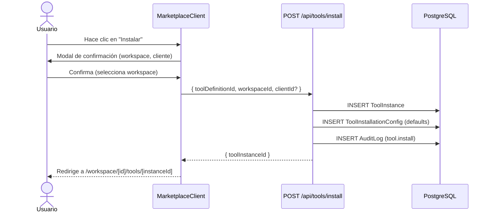

# ProTools Hub — Documentación Oficial

## Documento 05 — Marketplace de Herramientas

---

**Versión del documento:** 1.0  
**Fecha:** 2026-06-29  
**Estado:** Publicado

---

## Tabla de Contenidos

1. [Qué es el Marketplace](#1-qué-es-el-marketplace)
2. [Arquitectura del Catálogo Oficial](#2-arquitectura-del-catálogo-oficial)
3. [Herramientas por Dominio](#3-herramientas-por-dominio)
4. [Flujo de Instalación](#4-flujo-de-instalación)
5. [Búsqueda y Descubrimiento](#5-búsqueda-y-descubrimiento)
6. [Operaciones sobre Herramientas](#6-operaciones-sobre-herramientas)
7. [La Ruta Standalone `/tools`](#7-la-ruta-standalone-tools)
8. [Generación de Herramientas con IA](#8-generación-de-herramientas-con-ia)

---

## 1. Qué es el Marketplace

El **Marketplace** es el catálogo de herramientas disponibles para instalación en cualquier workspace. Contiene:

- **Herramientas oficiales** (`source='official'`): desarrolladas por ProTools Hub, validadas y con perfil de capacidades completo
- **Herramientas del usuario** (`source='user_ai'`): generadas por el usuario con IA
- **Herramientas importadas** (`source='import'`): convertidas desde archivos existentes (Excel, PDF...)

El marketplace está en la ruta standalone `/tools`, fuera del contexto de workspace, accesible para descubrimiento antes de decidir en qué workspace instalar.

---

## 2. Arquitectura del Catálogo Oficial

El catálogo oficial vive como código TypeScript en `apps/web/src/registry/official/`. Cada herramienta se define como un objeto con tres partes:

```typescript
// Estructura de una herramienta oficial
export const toolDefinition = {
  // Parte 1: ToolDefinition (la herramienta en sí)
  slug:        'iso9001-audit',
  name:        'Auditoría ISO 9001',
  description: 'Evaluación del sistema de gestión de calidad...',
  category:    'AUDIT',
  schema:      ToolSchemaV1,  // Ver Doc 06
  isPublic:    true,
  source:      'official',

  // Parte 2: ToolRegistryMeta (presentación en el marketplace)
  registryMeta: {
    displayCategory: 'Calidad',
    icon:            '🔍',
    color:           '#10B981',
    tags:            ['iso', 'calidad', 'certificación', 'auditoría'],
    keywords:        ['ISO 9001', 'SGC', 'gestión de calidad'],
    complexity:      'advanced',
    estimatedMinutes: 60,
    tier:            'official',
  },

  // Parte 3: ToolCapabilityProfile (inteligencia para los engines)
  capabilityProfile: {
    businessDomain:  'quality',
    businessGoals:   ['iso9001_certification', 'process_quality_control'],
    inputTypes:      ['company_info', 'quality_data'],
    outputTypes:     ['audit_report', 'action_plan'],
    dependencies:    [],
    relatedTools:    ['corrective-action', 'preventive-action'],
    executionCostEUR: 0.08,
    automationFriendly: true,
  },
}
```

### Seed del Catálogo

El catálogo se sincroniza con la DB mediante `prisma/seed.ts`:

```bash
npx prisma db seed
```

El seed hace `upsert` de todas las herramientas oficiales. Los cambios en el catálogo se aplican al re-ejecutar el seed.

---

## 3. Herramientas por Dominio

### Calidad (Quality)

| Herramienta | Slug | Descripción |
|---|---|---|
| Auditoría ISO 9001 | `iso9001-audit` | Evaluación completa del SGC |
| Acción Correctiva | `corrective-action` | Registro y seguimiento de NC |
| Acción Preventiva | `preventive-action` | Plan de prevención de fallos |
| Inspección de Calidad | `quality-inspection` | Checklist de inspección |
| Informe de No Conformidad | `nonconformity-report` | Registro de NC formal |
| Control de Documentos | `document-control` | Gestión documental ISO |

### Ventas (Sales)

| Herramienta | Slug | Descripción |
|---|---|---|
| CRM Leads | `crm-leads` | Gestión de contactos y leads |
| Seguimiento Oportunidades | `opportunity-tracking` | Pipeline de ventas |
| Pipeline de Ventas | `sales-pipeline` | Dashboard de ventas |
| Perfil de Cliente | `customer-profile` | Ficha completa de cliente |
| Propuesta Comercial | `proposal-template` | Generador de propuestas |

### Marketing

| Herramienta | Slug | Descripción |
|---|---|---|
| Plan de Contenidos | `content-plan` | Calendario editorial |
| Brief de Contenido | `content-brief` | Brief para creadores |
| Campaña Email | `email-campaign` | Email de campaña |
| Análisis Competencia | `competitor-analysis` | Estudio de competidores |
| Identidad de Marca | `brand-identity` | Definición de marca |

### RRHH (HR)

| Herramienta | Slug | Descripción |
|---|---|---|
| Onboarding de Empleado | `employee-onboarding` | Incorporación estándar |
| Evaluación de Desempeño | `performance-review` | Evaluación periódica |
| Descripción de Puesto | `job-description` | Oferta de empleo |
| Plan de Formación | `training-plan` | Itinerario de aprendizaje |
| Guía de Entrevista | `interview-guide` | Preguntas de selección |

### Auditoría / Consulting

| Herramienta | Slug | Descripción |
|---|---|---|
| Diagnóstico Empresarial | `company-diagnosis` | Análisis general empresa |
| Análisis DAFO | `swot-analysis` | Fortalezas y debilidades |
| Plan Estratégico | `strategic-plan` | Estrategia a 3-5 años |
| Modelo de Negocio Canvas | `business-model-canvas` | BMC completo |
| Madurez Digital | `digital-maturity` | Evaluación de digitalización |

### Compras (Procurement)

| Herramienta | Slug | Descripción |
|---|---|---|
| Evaluación de Proveedor | `supplier-evaluation` | Scoring de proveedor |
| Auditoría de Proveedor | `supplier-audit` | Auditoría in situ |
| Generador de RFP | `rfp-generator` | Solicitud de propuesta |
| Orden de Compra | `purchase-order` | Pedido formal |

### IT / Seguridad

| Herramienta | Slug | Descripción |
|---|---|---|
| Auditoría de Seguridad | `security-audit` | Evaluación de ciberseguridad |
| Checklist de Vulnerabilidades | `vulnerability-checklist` | Revisión técnica |
| Evaluación de Software | `software-evaluation` | Comparativa de herramientas |
| Plan de Proyecto IT | `project-plan` | Planificación de proyecto |

---

## 4. Flujo de Instalación



### Validaciones al Instalar

1. El usuario pertenece al workspace (filtro `orgId`)
2. El usuario tiene rol ≥ EDITOR
3. La herramienta está PUBLISHED
4. No existe ya una instancia activa de la misma herramienta en el workspace (warning, no bloquea)

---

## 5. Búsqueda y Descubrimiento

**Archivo:** `apps/web/src/lib/registry-intelligence/`

### Búsqueda Semántica

El marketplace usa búsqueda semántica multi-campo sobre `ToolRegistryMeta`:

```typescript
// registry-intelligence/searcher.ts
export function searchRegistry(
  query: string,
  tools: ToolWithMeta[]
): RankedResult[]
```

La búsqueda:
1. Normaliza el query (lowercase, sin tildes)
2. Busca matches en `name`, `description`, `tags`, `keywords`, `synonyms`
3. Pondera según el campo (name > tags > description)
4. Devuelve resultados ordenados por score

### Filtros Disponibles

- **Por categoría:** AUDIT, EVALUATION, CHECKLIST, CRM, REPORT, HR, OPERATIONS, FINANCE, CUSTOM
- **Por dominio de negocio:** quality, sales, marketing, hr, it...
- **Por tier:** official, community, partner, premium
- **Por complejidad:** simple, intermediate, advanced
- **Por favoritos:** herramientas marcadas como favoritas por el usuario

### RegistrySearch — Métricas de Búsqueda

Cada búsqueda registra un `RegistrySearch` en la DB:
```typescript
await db.registrySearch.create({
  data: {
    userId, orgId, workspaceId,
    prompt: query,
    resultsFound: results.length,
    topScore: results[0]?.score ?? 0,
  },
})
```

Esto permite medir: ¿Los usuarios encuentran lo que buscan? ¿Cuándo generan en lugar de instalar?

---

## 6. Operaciones sobre Herramientas

### Fork

El **fork** crea una copia de una `ToolDefinition` en el workspace del usuario, que puede modificar libremente.

```
POST /api/tools/fork
{ toolDefinitionId: string, workspaceId: string }

→ 201 { toolDefinitionId: string (nuevo) }
```

La herramienta forkeada tiene `source='fork'` y `orgId=user.orgId`.

### Favoritos

Los usuarios pueden marcar herramientas como favoritas. Se persisten en `ToolFavorite`.

```
POST /api/tools/[id]/favorite   → Añadir
DELETE /api/tools/[id]/favorite → Eliminar
```

### Compartir

Una `ToolInstance` puede compartirse públicamente vía un `shareToken` único.

```
POST /api/tools/[instanceId]/share
→ { shareUrl: string }

→ Accesible en /shared/[shareToken]
```

### Buscar Similares

El sistema puede encontrar herramientas similares a una dada.

```
POST /api/tools/search-similar
{ toolDefinitionId: string }

→ { similar: ToolWithMeta[] }
```

---

## 7. La Ruta Standalone `/tools`

El marketplace vive en `/tools` — **fuera del grupo `(dashboard)`**.

**Justificación:** El marketplace debe ser accesible desde fuera del workspace para:
- Descubrir herramientas antes de decidir dónde instalar
- Compartir links directos al catálogo
- SEO (si se hace pública)

**Componentes:**
- `MarketplaceHeader` — `<header>` con logo, búsqueda global, filtros
- `MarketplaceClient` — Client Component con la grid de herramientas
- `ToolCard` — Card de herramienta con instalación directa

Este layout con `<header>` y `<main>` propios es correcto e intencional (a diferencia de las páginas del workspace que NO deben tener su propio shell).

---

## 8. Generación de Herramientas con IA

Cuando el usuario no encuentra una herramienta en el catálogo, puede generarla:

**Ruta:** `/workspace/[id]/generate`

**Flujo:**
1. Usuario describe en lenguaje natural qué necesita
2. `POST /api/generate-tool` invoca al Execution Engine con un prompt especial
3. El modelo genera un `ToolSchemaV1` JSON válido
4. Se crea un `GenerationRequest` con el schema generado
5. El usuario puede revisar y aceptar o rechazar
6. Si acepta, se crea la `ToolDefinition` con `source='user_ai'`

**Prompt de generación:**
```
Eres un experto en diseño de herramientas empresariales.
Tu tarea es generar un ToolSchemaV1 JSON válido para:
"{naturalLanguage}"

El schema debe incluir campos apropiados para el caso de uso,
instrucciones IA claras y un título descriptivo.
```

El coste de generación se registra en `GenerationRequest.tokensUsed`.
