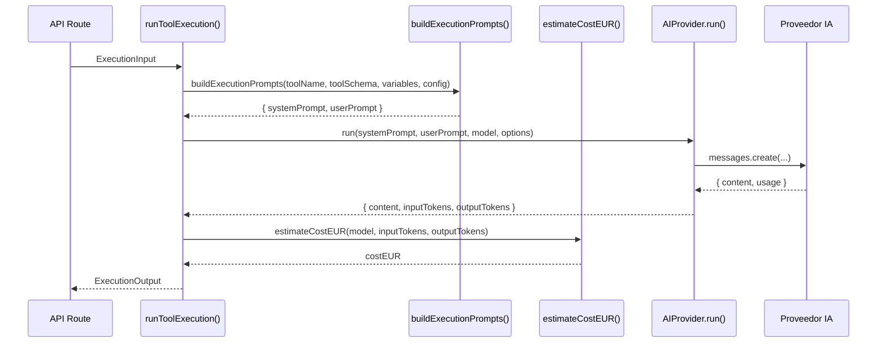

# ProTools Hub — Documentación Oficial

## Documento 07 — Execution Engine

---

**Versión del documento:** 1.0  
**Fecha:** 2026-06-29  
**Estado:** Publicado  
**Archivo fuente:** `apps/web/src/lib/execution-engine.ts`

---

## Tabla de Contenidos

1. [Responsabilidad](#1-responsabilidad)
2. [Interfaz Pública](#2-interfaz-pública)
3. [Arquitectura de Providers](#3-arquitectura-de-providers)
4. [Flujo de Ejecución](#4-flujo-de-ejecución)
5. [Construcción de Prompts](#5-construcción-de-prompts)
6. [Estimación de Costes](#6-estimación-de-costes)
7. [Rate Limiting](#7-rate-limiting)
8. [Persistencia](#8-persistencia)
9. [Integración con la API Route](#9-integración-con-la-api-route)
10. [Configuración de la Instalación](#10-configuración-de-la-instalación)

---

## 1. Responsabilidad

El **Execution Engine** es el único punto de entrada para todas las llamadas a proveedores de IA en ProTools Hub. Su única responsabilidad es:

> Dada una descripción de herramienta y un conjunto de variables del usuario, llamar al proveedor IA correcto, medir el resultado y devolver texto generado.

El engine **no conoce** workspaces, usuarios, permisos ni base de datos. Eso es responsabilidad de la API Route que lo invoca.

---

## 2. Interfaz Pública

```typescript
// Input del engine
export interface ExecutionInput {
  toolName:     string         // Nombre de la herramienta (para el prompt)
  toolSchema:   ToolSchemaV1  // Schema completo de la herramienta
  variables:    Record<string, unknown>  // Valores del usuario
  config?: {
    provider:    string       // 'anthropic' | 'openai'
    model:       string       // model ID
    temperature: number | null
    maxTokens:   number | null
    language:    string       // 'es' | 'en'
    outputFormat: string      // 'markdown' | 'plain' | 'json'
    systemPromptOverride?: string
    customInstructions?: string
  }
}

// Output del engine
export interface ExecutionOutput {
  result:          string   // Texto/markdown generado
  inputTokens:     number
  outputTokens:    number
  totalTokens:     number
  estimatedCostEUR: number
  durationMs:      number
  model:           string
  provider:        string
}

// Función pública del engine
export async function runToolExecution(
  input: ExecutionInput
): Promise<ExecutionOutput>
```

---

## 3. Arquitectura de Providers

El engine implementa el patrón **Provider** con una interfaz común:

```typescript
interface AIProvider {
  run(
    systemPrompt: string,
    userPrompt:   string,
    model:        string,
    options?: RunOptions
  ): Promise<{
    content:      string
    inputTokens:  number
    outputTokens: number
  }>
}
```

### Providers Implementados

| Provider | Clase | Modelos |
|---|---|---|
| `anthropic` | `AnthropicProvider` | claude-sonnet-4-6, claude-haiku-4-5, claude-opus-4-8 |
| `openai` | `OpenAIProvider` | gpt-4o-mini, gpt-4o |

### Selección de Provider

```typescript
function getProvider(providerName: string): AIProvider {
  switch (providerName) {
    case 'anthropic': return new AnthropicProvider()
    case 'openai':    return new OpenAIProvider()
    default: throw new Error(`Unknown provider: ${providerName}`)
  }
}
```

### Extensibilidad

Para añadir un nuevo provider (Google Gemini, Mistral, etc.):
1. Crear clase que implemente `AIProvider`
2. Añadir case en `getProvider()`
3. Añadir precios en `ai-cost.ts`

El código consumidor no cambia.

---

## 4. Flujo de Ejecución



---

## 5. Construcción de Prompts

El engine construye los prompts de forma determinista y reproducible.

### System Prompt

El system prompt describe al modelo:
- Qué herramienta está ejecutando
- En qué idioma responder
- Formato de salida (markdown, plain, json)
- Instrucciones personalizadas (si las hay)

```
Eres un asistente especializado en {toolName}.
Tu tarea es generar {outputFormat} en {language}.
{customInstructions}
```

Si `systemPromptOverride` está definido en la `ToolInstallationConfig`, se usa en lugar del prompt generado automáticamente.

### User Prompt

El user prompt contiene:
- Los campos del schema con sus labels y valores del usuario
- Las instrucciones del schema (si existen)

```
HERRAMIENTA: {toolName}

DATOS:
- {fieldLabel1}: {value1}
- {fieldLabel2}: {value2}
...

INSTRUCCIONES: {schema.aiInstructions}
```

### Almacenamiento para Auditoría

Los prompts generados se almacenan en `ToolExecution.systemPrompt` y `ToolExecution.userPrompt`. Esto permite:
- Re-ejecutar con los mismos prompts
- Auditoría del contenido generado
- Depuración de resultados inesperados

---

## 6. Estimación de Costes

**Archivo:** `apps/web/src/lib/ai-cost.ts`

```typescript
export function estimateCostEUR(
  model: string,
  inputTokens: number,
  outputTokens: number
): number
```

### Tabla de Precios (Referencia)

| Modelo | Input (EUR/1M tokens) | Output (EUR/1M tokens) |
|---|---|---|
| `claude-sonnet-4-6` | ~€2.50 | ~€12.50 |
| `claude-haiku-4-5` | ~€0.21 | ~€1.05 |
| `claude-opus-4-8` | ~€4.62 | ~€23.10 |
| `gpt-4o-mini` | ~€0.13 | ~€0.50 |
| `gpt-4o` | ~€2.31 | ~€6.93 |

> Los precios se actualizan en `ai-cost.ts` al cambiar las tarifas de los proveedores. Son estimaciones en EUR basadas en el tipo de cambio USD/EUR.

### Almacenamiento del Coste

El coste estimado se almacena en:
- `ToolExecution.estimatedCostEUR` — coste de cada ejecución
- `AIUsage.estimatedCostEUR` — coste para rate limiting y analytics
- `WorkflowNodeExecution.estimatedCostEUR` — coste por nodo
- `WorkflowExecution.totalCostEUR` — coste total del workflow

---

## 7. Rate Limiting

**Archivo:** `apps/web/src/lib/ai-rate-limit.ts`

El rate limiting se aplica **antes** de invocar el Execution Engine, en la API Route.

### Límites por Nivel

```typescript
// Configurados en variables de entorno
MAX_AI_GENERATIONS_PER_USER_DAY=10          // Por usuario/día
MAX_AI_GENERATIONS_PER_WORKSPACE_DAY=20     // Por workspace/día
MAX_AI_GENERATIONS_GLOBAL_DAY=50            // Global/día
MAX_AI_ESTIMATED_COST_DAY_EUR=2.0           // Coste máximo/día
```

### Consulta de Límites

Los límites se consultan via `AIUsage`:

```typescript
const todayUsage = await db.aIUsage.count({
  where: {
    userId,
    createdAt: { gte: startOfDay },
    status: 'success',
  },
})
```

### Plan-Based Limits

El `trialPlan` del usuario determina los límites efectivos:

| Plan | Generaciones/día | Generaciones/mes |
|---|---|---|
| `trial_personal` | 10 | 100 |
| `trial_business` | 25 | 500 |
| `blocked` | 0 | 0 |

Si se supera el límite, la API devuelve `429 Too Many Requests` y registra el evento `rate_limit.exceeded` en el AuditLog.

---

## 8. Persistencia

El Execution Engine en sí no escribe en la DB. La API Route que lo invoca maneja la persistencia:

### Antes de la Ejecución

```typescript
// INSERT ToolExecution (PENDING)
const execution = await db.toolExecution.create({
  data: {
    toolInstanceId,
    workspaceId,
    userId: user.id,
    status: 'PENDING',
    variables,
    model: config.model,
    provider: config.provider,
    systemPrompt,
    userPrompt,
  },
})
```

### Después de la Ejecución

```typescript
// UPDATE ToolExecution (COMPLETED)
await db.toolExecution.update({
  where: { id: execution.id },
  data: {
    status: 'COMPLETED',
    result: output.result,
    inputTokens: output.inputTokens,
    outputTokens: output.outputTokens,
    estimatedCostEUR: output.estimatedCostEUR,
    durationMs: output.durationMs,
  },
})

// INSERT AIUsage
await db.aIUsage.create({
  data: {
    userId: user.id,
    orgId: user.orgId,
    workspaceId,
    model: output.model,
    inputTokens: output.inputTokens,
    outputTokens: output.outputTokens,
    totalTokens: output.totalTokens,
    estimatedCostEUR: output.estimatedCostEUR,
    durationMs: output.durationMs,
    status: 'success',
  },
})

// Audit (fire-and-forget)
void audit({ orgId, actorUserId, action: 'tool.execute', ... })
```

---

## 9. Integración con la API Route

**Archivo:** `apps/web/src/app/api/execute-tool/route.ts`

```typescript
export async function POST(request: Request) {
  // 1. Autenticación
  const user = await requireUser()
  
  // 2. Parse del body
  const { toolInstanceId, workspaceId, variables } = await request.json()
  
  // 3. Rate limiting
  await checkRateLimit(user.id, workspaceId, user.orgId)
  
  // 4. Cargar ToolInstance + ToolDefinition + Config
  const instance = await db.toolInstance.findFirst({
    where: { id: toolInstanceId, workspaceId, workspace: { orgId: user.orgId } },
    include: { toolDefinition: true, installationConfig: true },
  })
  
  // 5. Crear registro PENDING
  const execution = await db.toolExecution.create(...)
  
  // 6. Ejecutar IA
  const output = await runToolExecution({
    toolName: instance.toolDefinition.name,
    toolSchema: instance.toolDefinition.schema as ToolSchemaV1,
    variables,
    config: mapInstallConfig(instance.installationConfig),
  })
  
  // 7. Actualizar registro + AIUsage + Audit
  await Promise.all([...])
  
  // 8. Respuesta
  return NextResponse.json({ executionId: execution.id, result: output.result, ... })
}
```

---

## 10. Configuración de la Instalación

Cada `ToolInstance` puede tener una `ToolInstallationConfig` que personaliza cómo el Execution Engine usa la IA para esa instalación concreta:

| Configuración | Default | Efecto |
|---|---|---|
| `provider` | `anthropic` | Proveedor IA usado |
| `model` | `claude-sonnet-4-6` | Modelo específico |
| `temperature` | `null` (provider default) | Creatividad del modelo |
| `maxTokens` | `null` (provider default) | Límite de tokens de salida |
| `language` | `es` | Idioma de la respuesta |
| `outputFormat` | `markdown` | Formato de salida |
| `systemPromptOverride` | `null` | Reemplaza el system prompt automático |
| `customInstructions` | `null` | Se añade al final del system prompt |
| `defaultVariables` | `{}` | Pre-relleno de campos |

Si no hay `ToolInstallationConfig`, el engine usa los valores por defecto.
