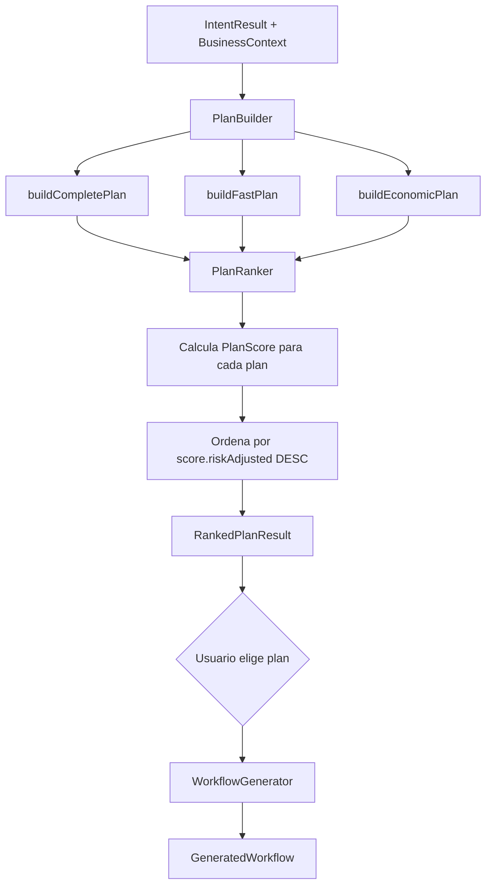

# ProTools Hub — Documentación Oficial

## Documento 09 — Planning Engine

---

**Versión del documento:** 1.0  
**Fecha:** 2026-06-29  
**Estado:** Publicado  
**Archivos fuente:** `apps/web/src/lib/planning-engine/`

---

## Tabla de Contenidos

1. [Responsabilidad](#1-responsabilidad)
2. [Tipos del Sistema](#2-tipos-del-sistema)
3. [Las Tres Estrategias](#3-las-tres-estrategias)
4. [Sistema de Scoring 6D](#4-sistema-de-scoring-6d)
5. [Flujo de Generación de Planes](#5-flujo-de-generación-de-planes)
6. [WorkflowGenerator](#6-workflowgenerator)
7. [Integración con el Copilot](#7-integración-con-el-copilot)
8. [API Route](#8-api-route)

---

## 1. Responsabilidad

El **Planning Engine** transforma un `IntentResult` (del Intent Engine) en uno o varios `ExecutionPlan` ordenados por calidad. El usuario elige uno, y el sistema genera un workflow ejecutable a partir del plan elegido.

> Convierte el "qué" (objetivo del usuario) en el "cómo" (plan de herramientas, fases y pasos).

El engine no llama a IA. Usa el grafo de herramientas y el `BusinessContext` para generar planes deterministas.

---

## 2. Tipos del Sistema

**Archivo:** `apps/web/src/lib/planning-engine/planner-types.ts`

```typescript
// Plan completo de ejecución
export interface ExecutionPlan {
  id:             string
  strategyType:   'complete' | 'fast' | 'economic'
  label:          string          // "Plan Completo de Certificación ISO 9001"
  description:    string
  domain:         string
  canonicalGoal:  string
  phases:         PlanPhase[]
  score:          PlanScore
  reasoning:      PlanReasoning
  estimatedDays:  number
  totalTools:     number
  riskLevel:      'low' | 'medium' | 'high'
  isRecommended:  boolean         // true en el plan con mayor score
}

// Fase del plan (agrupa pasos relacionados)
export interface PlanPhase {
  id:          string
  order:       number
  label:       string            // "Fase 1: Diagnóstico"
  description: string
  steps:       PlanStep[]
  estimatedDays: number
}

// Paso concreto (mapea a una herramienta)
export interface PlanStep {
  id:              string
  order:           number
  toolSlug:        string
  toolName:        string
  description:     string
  isRequired:      boolean
  estimatedMinutes: number
  dependsOn:       string[]      // IDs de steps previos
  inputMapping:    Record<string, string>   // fieldId → "${variable}" o valor
}

// Score multi-dimensión
export interface PlanScore {
  overall:     number   // 0-100 — score combinado
  feasibility: number   // ¿Tiene las herramientas necesarias?
  completeness: number  // ¿Cubre todos los objetivos?
  speed:       number   // ¿Qué tan rápido se completa?
  cost:        number   // ¿Qué tan económico es?
  businessFit: number   // ¿Alineado con el contexto de la empresa?
  riskAdjusted: number  // Score ajustado por riesgos detectados
}

// Razonamiento del planificador
export interface PlanReasoning {
  strategyChoice:   string    // Por qué se eligió esta estrategia
  toolSelection:    string    // Por qué se eligieron estas herramientas
  phaseDesign:      string    // Por qué se estructuró así
  riskConsiderations: string  // Riesgos identificados
  contextAlignment:  string  // Cómo el plan usa el BusinessContext
}

// Resultado ranked de múltiples planes
export interface RankedPlanResult {
  plans:       ExecutionPlan[]     // ordenados de mayor a menor score.overall
  recommended: ExecutionPlan       // plans[0] — el más adecuado
  context:     BusinessContext     // contexto usado para generar los planes
}

// Workflow generado desde un plan
export interface GeneratedWorkflow {
  name:        string
  description: string
  nodes:       GeneratedNode[]
  connections: GeneratedConnection[]
  variables:   GeneratedVariable[]
}
```

---

## 3. Las Tres Estrategias

El Planning Engine siempre genera exactamente tres planes alternativos:

### Estrategia `complete` — Plan Completo

- Incluye **todas** las herramientas del `CanonicalGoal` y sus dependencias
- Múltiples fases (3-5 típicamente)
- Máxima cobertura y calidad
- Mayor tiempo y coste estimado
- Score alto en `completeness` y `businessFit`

### Estrategia `fast` — Plan Rápido

- Incluye solo las herramientas **esenciales** (isRequired = true)
- Menos fases (1-2)
- Tiempo mínimo para obtener un resultado viable
- Score alto en `speed`

### Estrategia `economic` — Plan Económico

- Herramientas con **menor coste de ejecución** IA (estimatedCostEUR bajo)
- Puede usar modelos más económicos (Haiku)
- Score alto en `cost`

### Ejemplo: Goal `iso9001_certification`

| Estrategia | Herramientas | Fases | Días est. | Coste est. |
|---|---|---|---|---|
| complete | iso9001-audit, corrective-action, preventive-action, quality-inspection, document-control, management-review | 3 fases | 21 días | €0.45 |
| fast | iso9001-audit, corrective-action | 1 fase | 5 días | €0.12 |
| economic | iso9001-audit | 1 fase | 2 días | €0.05 |

---

## 4. Sistema de Scoring 6D

El score de cada plan se calcula en 6 dimensiones, cada una de 0 a 100:

### Feasibility (Factibilidad)

```
score = (herramientas_disponibles / herramientas_requeridas) * 100
```

Una herramienta está disponible si existe en el catálogo con status `PUBLISHED`. Si el workspace tiene la herramienta instalada, bonus de +10%.

### Completeness (Completitud)

```
score = (goals_cubiertos / goals_del_canonical_goal) * 100
```

Cuántos de los `businessGoals` del CanonicalGoal están cubiertos por el plan.

### Speed (Velocidad)

```
score = 100 - (estimatedDays / maxDays) * 100
```

Relativo al plan más largo de los tres. El plan `fast` siempre tiene score máximo en esta dimensión.

### Cost (Economía)

```
score = 100 - (totalCostEUR / maxCostEUR) * 100
```

Relativo al plan más caro. El plan `economic` siempre tiene score máximo.

### Business Fit (Adecuación al Negocio)

El score más complejo. Considera:
- ¿El sector de la empresa es relevante para las herramientas?
- ¿Hay normativas activas que aumenten la prioridad?
- ¿Hay objetivos activos vinculados a este goal?
- ¿El nivel de madurez digital es compatible con el plan?

```
businessFit = sectorBonus + regulationBonus + objectiveBonus + maturityBonus
// cada bonus: 0-25, total 0-100
```

### Risk Adjusted (Ajuste por Riesgo)

```
riskAdjusted = overall * (1 - riskPenalty)
```

Donde `riskPenalty` es:
- `low`: 0.0 (sin penalización)
- `medium`: 0.1 (-10%)
- `high`: 0.25 (-25%)

El nivel de riesgo se determina por:
- Número de herramientas con dependencias no resueltas
- Presencia de riesgos críticos en el BusinessContext relacionados con el dominio

### Score Overall

```
overall = (feasibility * 0.25) + (completeness * 0.20) + (speed * 0.15) +
          (cost * 0.15) + (businessFit * 0.25)
```

---

## 5. Flujo de Generación de Planes



### BuildPlan

Cada builder:
1. Obtiene las herramientas del `CanonicalGoal` del `IntentResult`
2. Filtra según la estrategia (all, required-only, low-cost)
3. Resuelve dependencias (topological sort)
4. Asigna fases lógicas (setup, execution, review)
5. Calcula estimaciones de tiempo y coste

---

## 6. WorkflowGenerator

Una vez el usuario selecciona un plan, el `WorkflowGenerator` convierte el `ExecutionPlan` en un `GeneratedWorkflow` que puede guardarse en la DB:

```typescript
export function generateWorkflow(
  plan: ExecutionPlan,
  workspaceId: string,
  toolDefinitions: ToolDefinition[]
): GeneratedWorkflow
```

### Lógica de Posicionamiento

Los nodos del workflow se posicionan automáticamente en el canvas de React Flow:
- Cada fase ocupa una columna
- Los nodos dentro de una fase se distribuyen verticalmente
- Las conexiones siguen el orden de las dependencias del plan

```typescript
// Cálculo de posición por orden topológico
const positionX = phase.order * 300    // 300px entre fases
const positionY = stepIndex * 150      // 150px entre steps
```

### Input Mapping Automático

El WorkflowGenerator intenta mapear automáticamente los inputs entre nodos:
- Si el output de un nodo anterior es un input del siguiente, lo conecta con `{{nodes.nodeId.output}}`
- Las variables del workflow se usan para inputs comunes (`{{variables.companyName}}`)

---

## 7. Integración con el Copilot

El Copilot usa el Planning Engine en la fase `planning`:

```typescript
// business-copilot/orchestrator.ts
const { plans, recommended } = await generatePlans({
  intentResult,
  businessContext,
})

// Serializa para almacenar en CopilotConversation
const planSummaries: PlanSummary[] = plans.map(p => ({
  id:            p.id,
  strategyType:  p.strategyType,
  label:         p.label,
  description:   p.description,
  totalTools:    p.totalTools,
  estimatedDays: p.estimatedDays,
  score:         p.score.overall,
  riskLevel:     p.riskLevel,
  isRecommended: p.isRecommended,
  toolSlugs:     p.phases.flatMap(ph => ph.steps.map(s => s.toolSlug)),
  reasoning:     p.reasoning.strategyChoice,
}))

return transition({
  phase: 'planning',
  rankedPlans: planSummaries,
  message: buildPlanningMessage(plans, recommended),
})
```

El `selectedPlan` (plan completo) se almacena en `CopilotConversation.selectedPlan` cuando el usuario elige.

---

## 8. API Route

**Archivo:** `apps/web/src/app/api/plans/generate/route.ts`

```
POST /api/plans/generate
{
  workspaceId:  string,
  intentResult: IntentResult,
  includeBusinessContext?: boolean
}

→ 200 {
  plans: ExecutionPlan[],
  recommended: ExecutionPlan,
  context: BusinessContext
}
```

Uso directo (fuera del Copilot) para integraciones y testing.
