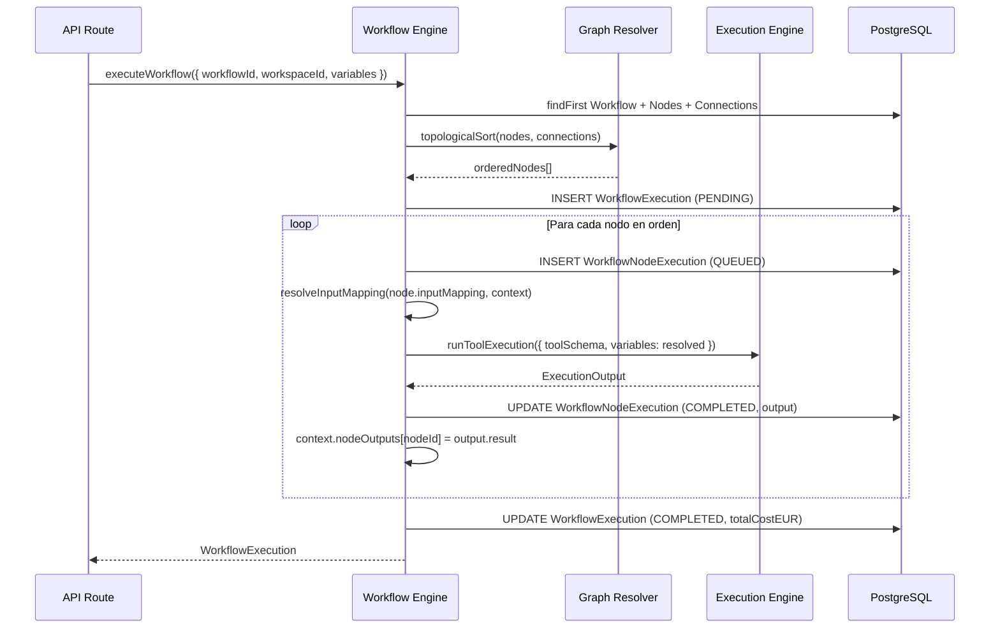
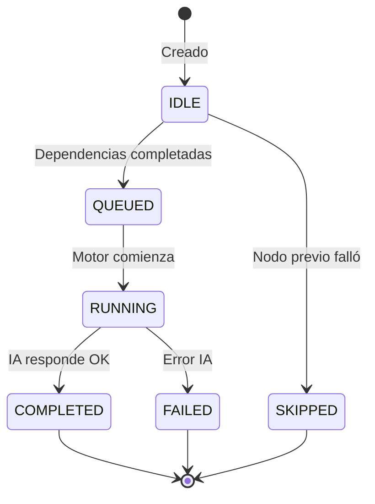

# ProTools Hub — Documentación Oficial

## Documento 10 — Workflow Engine

---

**Versión del documento:** 1.0  
**Fecha:** 2026-06-29  
**Estado:** Publicado  
**Archivos fuente:** `apps/web/src/lib/workflow-engine.ts`, `workflow-graph.ts`, `workflow-variables.ts`

---

## Tabla de Contenidos

1. [Responsabilidad](#1-responsabilidad)
2. [Modelo de Datos del Workflow](#2-modelo-de-datos-del-workflow)
3. [Editor Visual React Flow](#3-editor-visual-react-flow)
4. [Interpolación de Variables](#4-interpolación-de-variables)
5. [Ejecución del Workflow](#5-ejecución-del-workflow)
6. [Estado de Ejecución por Nodo](#6-estado-de-ejecución-por-nodo)
7. [API Routes](#7-api-routes)
8. [Integración con el Copilot](#8-integración-con-el-copilot)

---

## 1. Responsabilidad

El **Workflow Engine** permite crear y ejecutar grafos dirigidos de herramientas IA. Cada nodo del grafo es una `ToolDefinition` que se ejecuta con el Execution Engine. El output de un nodo puede ser el input del siguiente.

**Analogía:** Un workflow es como una cadena de montaje donde cada estación (herramienta) recibe el trabajo de la anterior y pasa su resultado a la siguiente.

---

## 2. Modelo de Datos del Workflow

Un workflow completo está compuesto por:

```
Workflow
├── WorkflowNode[]         ← Nodos (herramientas)
├── WorkflowConnection[]   ← Aristas (relaciones)
├── WorkflowVariable[]     ← Variables globales
└── WorkflowExecution[]    ← Historial de ejecuciones
    └── WorkflowNodeExecution[] ← Estado por nodo
        └── WorkflowExecutionLog[] ← Logs detallados
```

### Workflow

| Campo | Descripción |
|---|---|
| `name` | Nombre del workflow |
| `status` | DRAFT/PUBLISHED/ARCHIVED |
| `version` | Versión (incrementa al publicar) |
| `isActive` | Si puede ejecutarse |

Los workflows nuevos creados via Copilot empiezan como `DRAFT`. El usuario los publica manualmente.

### WorkflowNode

| Campo | Descripción |
|---|---|
| `toolDefinitionId` | La herramienta que representa |
| `label` | Nombre en el canvas |
| `positionX/Y` | Coordenadas React Flow |
| `inputMapping` | `Record<fieldId, template>` — mapeo de inputs |
| `configOverride` | Override de modelo/temperatura para este nodo |
| `executionOrder` | Orden topológico (calculado) |

### WorkflowConnection

```
sourceNodeId → targetNodeId
```

Arista dirigida. Un nodo puede tener múltiples entradas y salidas.

### WorkflowVariable

Variables globales del workflow:
- Definidas una vez, usadas en múltiples nodos
- Se solicitan al usuario antes de ejecutar
- Tipos: `string | number | boolean`

---

## 3. Editor Visual React Flow

**Ruta:** `/workspace/[workspaceId]/workflows/[workflowId]`

El editor usa **React Flow** para el canvas interactivo.

### Operaciones del Editor

| Operación | Descripción |
|---|---|
| Añadir nodo | Drag & drop desde el panel de herramientas |
| Conectar nodos | Click en handle de salida → handle de entrada |
| Configurar nodo | Panel lateral con inputMapping y configOverride |
| Añadir variable | Panel de variables globales |
| Ejecutar | Botón "Ejecutar Workflow" |

### Guardado Automático

Los cambios en el canvas se guardan automáticamente (debounce 1 segundo) via Server Action o API Route.

### Posicionamiento Automático

Al crear un workflow desde el Copilot, los nodos se posicionan automáticamente:
```typescript
// workflow-graph.ts
function calculateLayout(nodes: WorkflowNode[]): PositionedNode[] {
  // Ordena por executionOrder
  // Distribuye en columnas por fase
  // 300px entre columnas, 150px entre filas
}
```

---

## 4. Interpolación de Variables

El sistema de variables permite conectar el output de un nodo con el input del siguiente.

**Archivo:** `apps/web/src/lib/workflow-variables.ts`

### Sintaxis de Templates

```
{{variables.key}}             → Variable global del workflow
{{nodes.nodeId.output}}       → Output completo del nodo anterior
{{nodes.nodeId.field.value}}  → Campo específico de un nodo
```

### Ejemplo de inputMapping

```json
{
  "company_name": "{{variables.companyName}}",
  "audit_scope":  "{{nodes.node1.output}}",
  "sector":       "{{variables.sector}}"
}
```

### Resolución en Tiempo de Ejecución

```typescript
// workflow-variables.ts
export function resolveInputMapping(
  mapping: Record<string, string>,
  context: ExecutionContext
): Record<string, string> {
  const resolved: Record<string, string> = {}
  
  for (const [key, template] of Object.entries(mapping)) {
    resolved[key] = interpolate(template, context)
  }
  
  return resolved
}

function interpolate(template: string, context: ExecutionContext): string {
  return template
    .replace(/\{\{variables\.(\w+)\}\}/g, (_, key) => context.variables[key] ?? '')
    .replace(/\{\{nodes\.(\w+)\.output\}\}/g, (_, nodeId) => context.nodeOutputs[nodeId] ?? '')
}
```

---

## 5. Ejecución del Workflow

**Archivo:** `apps/web/src/lib/workflow-engine.ts`

**API Route:** `POST /api/workflows/[workflowId]/execute`

### Flujo de Ejecución



### Topological Sort

El `Graph Resolver` ordena los nodos usando Kahn's Algorithm:
1. Calcula el in-degree de cada nodo
2. Nodos con in-degree 0 → primera ronda
3. Procesa por capas hasta vaciar la cola

Si hay ciclos, la ejecución falla con `FAILED` y log de error.

### Manejo de Errores por Nodo

Si un nodo falla:
- El `WorkflowNodeExecution` se marca como `FAILED`
- Los nodos dependientes se marcan como `SKIPPED`
- El `WorkflowExecution` se marca como `FAILED`
- Se sigue ejecutando nodos independientes del fallido

---

## 6. Estado de Ejecución por Nodo



### WorkflowExecutionLog

Cada transición de estado genera un log:

```typescript
await db.workflowExecutionLog.create({
  data: {
    workflowExecutionId,
    workflowNodeId,
    level: 'info',
    message: `Node "${node.label}" completed in ${durationMs}ms`,
    metadata: { inputTokens, outputTokens, model, costEUR },
  },
})
```

---

## 7. API Routes

### POST /api/workflows/[workflowId]/execute

Ejecuta el workflow completo.

```typescript
// Input
{
  workspaceId: string,
  variables:   Record<string, string>  // Variables globales
}

// Output
{
  executionId:   string,
  status:        'COMPLETED' | 'FAILED',
  finalOutput:   string,          // Output del último nodo
  totalCostEUR:  number,
  durationMs:    number,
  nodeResults:   WorkflowNodeResult[]
}
```

### GET /api/workflows/[workflowId]/executions

Lista el historial de ejecuciones.

### GET /api/workflows/[workflowId]/executions/[executionId]

Detalle de una ejecución con logs de cada nodo.

---

## 8. Integración con el Copilot

Cuando el Copilot genera un workflow:

1. `WorkflowGenerator` crea la estructura `GeneratedWorkflow`
2. La API Route guarda el workflow en DB:
   - Crea `Workflow` (status: DRAFT)
   - Crea `WorkflowNode[]` con posiciones calculadas
   - Crea `WorkflowConnection[]` según las dependencias del plan
   - Crea `WorkflowVariable[]` para las variables del plan
3. Devuelve `workflowId` al Copilot
4. El Copilot muestra botón "Ir al workflow"
5. El workflow queda en el editor para que el usuario lo revise antes de ejecutar

**Principio:** El Copilot nunca ejecuta el workflow automáticamente. El usuario decide cuándo ejecutar.
