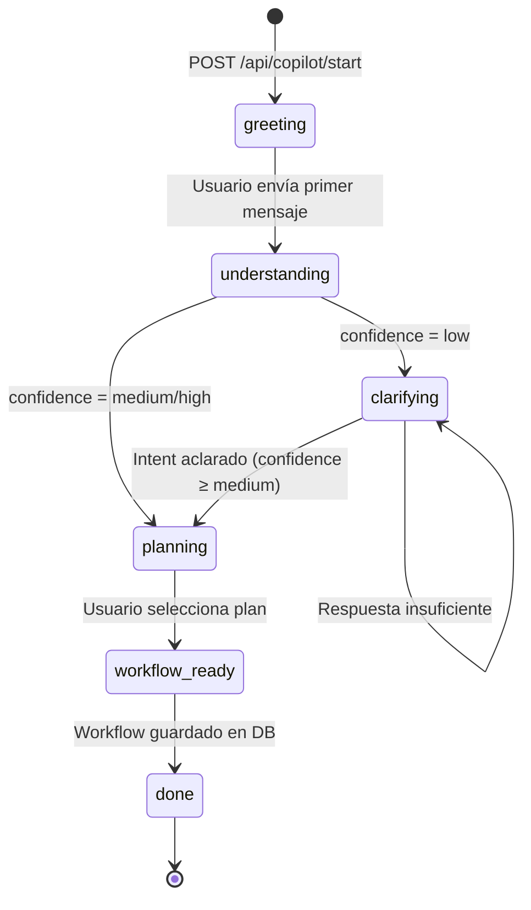

# ProTools Hub — Documentación Oficial

## Documento 12 — Business Copilot

---

**Versión del documento:** 1.0  
**Fecha:** 2026-06-29  
**Estado:** Publicado  
**Archivos fuente:** `apps/web/src/lib/business-copilot/`

---

## Tabla de Contenidos

1. [Qué es el Business Copilot](#1-qué-es-el-business-copilot)
2. [Máquina de Estados](#2-máquina-de-estados)
3. [Tipos del Sistema](#3-tipos-del-sistema)
4. [Fases en Detalle](#4-fases-en-detalle)
5. [API Routes del Copilot](#5-api-routes-del-copilot)
6. [CopilotInterface — Componente de UI](#6-copilotinterface--componente-de-ui)
7. [Sugerencias del Copilot](#7-sugerencias-del-copilot)
8. [Persistencia de la Conversación](#8-persistencia-de-la-conversación)

---

## 1. Qué es el Business Copilot

El **Business Copilot** es un Director de Operaciones IA que orquesta los engines del sistema para guiar al usuario desde un objetivo difuso hasta un workflow ejecutable.

**No es un chatbot genérico.** No llama a IA para cada respuesta. Usa:
- **Business Memory** para conocer la empresa
- **Intent Engine** para entender el objetivo
- **Planning Engine** para generar planes estructurados
- **Workflow Generator** para crear el workflow ejecutable

El copilot tiene una **máquina de estados** con 6 fases. La conversación progresa de forma determinista — cada mensaje del usuario avanza el estado.

---

## 2. Máquina de Estados



**Transiciones:**
- Cada `POST /api/copilot/message` puede avanzar el estado
- `POST /api/copilot/select-plan` transiciona de `planning` a `workflow_ready`
- El estado persiste en `CopilotConversation` en la DB

---

## 3. Tipos del Sistema

**Archivo:** `apps/web/src/lib/business-copilot/copilot-types.ts`

```typescript
// Fases de la conversación
export type CopilotPhase =
  | 'greeting'       // Muestra contexto empresa + sugerencias
  | 'understanding'  // Procesando el objetivo
  | 'clarifying'     // Hace exactamente 1 pregunta de aclaración
  | 'planning'       // Muestra los 3 planes
  | 'workflow_ready' // Plan elegido, workflow generado
  | 'done'           // Conversación cerrada

// Categorías de sugerencia
export type SuggestionCategory =
  | 'objective'  // Continúa un objetivo activo
  | 'risk'       // Mitiga un riesgo detectado
  | 'process'    // Mejora un proceso conocido
  | 'domain'     // Cubre un dominio sin explorar
  | 'analytics'  // Acción sugerida por historial

// Sugerencia de inicio rápido
export interface CopilotSuggestion {
  id:            string
  category:      SuggestionCategory
  label:         string              // "Preparar certificación ISO 9001"
  description:   string             // "Tu empresa tiene regulaciones de calidad activas"
  canonicalGoal: string | null
  icon:          string             // emoji
}

// Resumen de plan para la UI (versión ligera de ExecutionPlan)
export interface PlanSummary {
  id:            string
  strategyType:  'complete' | 'fast' | 'economic'
  label:         string
  description:   string
  totalTools:    number
  estimatedDays: number
  score:         number    // 0-100
  riskLevel:     string
  isRecommended: boolean
  toolSlugs:     string[]
  reasoning:     string
}

// Respuesta completa del Copilot
export interface CopilotResponse {
  conversationId: string
  phase:          CopilotPhase
  message:        string           // Respuesta en lenguaje natural
  context:        BusinessContext  // Siempre incluido
  suggestions:    CopilotSuggestion[]  // En greeting/done
  plans:          PlanSummary[]        // En planning
  selectedPlan:   ExecutionPlan | null // En workflow_ready
  workflowId:     string | null        // En workflow_ready
  question:       string | null        // En clarifying
  actions:        CopilotAction[]      // Botones de acción
  responseMs:     number
}

// Acción de botón
export interface CopilotAction {
  id:    string
  label: string
  type:  'select_plan' | 'generate_workflow' | 'save_objective' | 'more_info' | 'restart'
  data?: Record<string, string>
}
```

---

## 4. Fases en Detalle

### Fase 1: greeting

**Trigger:** `POST /api/copilot/start`

**Acciones:**
1. Crea `CopilotConversation` con `phase: 'greeting'`
2. Carga `BusinessContext` del workspace
3. Genera `CopilotSuggestion[]` con `getCopilotSuggestions()`
4. Genera mensaje de bienvenida personalizado

**Mensaje ejemplo:**
```
¡Hola! Soy tu Director de Operaciones.

Conozco estos datos de tu empresa:
- ACME SL — Tecnología B2B — España
- Tamaño: pequeña (15 empleados)
- Madurez digital: en desarrollo

¿En qué quieres trabajar hoy?
```

**Sugerencias mostradas:**
- Si hay objetivos activos → sugerencia para cada uno
- Si hay riesgos críticos → sugerencia de mitigación
- Si hay dominios sin explorar → sugerencia de inicio

---

### Fase 2: understanding

**Trigger:** Primer mensaje del usuario

**Acciones:**
1. Invoca el **Intent Engine** con el mensaje del usuario
2. Enriquece con `BusinessContext`
3. Si `confidence = low` → transiciona a `clarifying`
4. Si `confidence = medium | high` → invoca **Planning Engine**

**Duración:** Siempre pasa por esta fase. No hay respuesta visible — es un estado de transición.

---

### Fase 3: clarifying

**Trigger:** Intent Engine devuelve `needsClarification: true`

**Acciones:**
1. Usa la `suggestedQuestion` del Intent Engine
2. Almacena la pregunta en `CopilotConversation.clarifyingQuestion`
3. Responde con exactamente **una pregunta**

**Principio:** El Copilot nunca hace más de una pregunta por turno.

**Ejemplo:**
```
Entiendo que quieres trabajar en calidad, pero necesito saber más.
¿Tu objetivo principal es preparar una certificación ISO, mejorar procesos 
internos, o auditar a tus proveedores?
```

Cuando el usuario responde, vuelve a `understanding` con el contexto acumulado.

---

### Fase 4: planning

**Trigger:** Intent Engine con `confidence = high`

**Acciones:**
1. Invoca el **Planning Engine** → `RankedPlanResult`
2. Serializa los planes como `PlanSummary[]`
3. Almacena en `CopilotConversation.rankedPlans`
4. Genera mensaje de presentación de planes

**Respuesta:**
```
Basándome en tu objetivo (Certificación ISO 9001) y el perfil de ACME SL,
he diseñado 3 planes:

⭐ Plan Completo (Recomendado) — 84 puntos
Cubre toda la preparación ISO en 21 días.
Herramientas: iso9001-audit, corrective-action, preventive-action...

⚡ Plan Rápido — 71 puntos
Resultado en 5 días con las herramientas esenciales.

💰 Plan Económico — 63 puntos
Mínimo coste de IA, resultado básico en 2 días.
```

---

### Fase 5: workflow_ready

**Trigger:** `POST /api/copilot/select-plan` con `planId`

**Acciones:**
1. Recupera el plan completo (`ExecutionPlan`) desde el `planId`
2. Invoca `WorkflowGenerator` para crear el grafo
3. Guarda el `Workflow` en la DB con status `DRAFT`
4. Almacena el `generatedWorkflowId` en la conversación

**Respuesta:**
```
He creado tu workflow "Certificación ISO 9001 — Plan Completo".

Incluye 6 herramientas conectadas en 3 fases:
Fase 1: Auditoría inicial
Fase 2: Acciones correctivas
Fase 3: Revisión final

Puedes ejecutarlo ahora o editarlo en el editor visual.
```

---

### Fase 6: done

**Trigger:** Automático tras `workflow_ready` o comando explícito del usuario.

La conversación se cierra. Se puede iniciar una nueva.

---

## 5. API Routes del Copilot

### POST /api/copilot/start

Inicia una nueva conversación.

```
POST /api/copilot/start
{ workspaceId: string }

→ 200 CopilotResponse (phase: 'greeting')
```

---

### POST /api/copilot/message

Envía un mensaje en la conversación activa.

```
POST /api/copilot/message
{
  conversationId: string,
  workspaceId:    string,
  message:        string
}

→ 200 CopilotResponse (phase puede avanzar)
```

---

### POST /api/copilot/select-plan

Selecciona un plan de los propuestos.

```
POST /api/copilot/select-plan
{
  conversationId: string,
  workspaceId:    string,
  planId:         string
}

→ 200 CopilotResponse (phase: 'workflow_ready', workflowId: string)
```

---

### GET /api/copilot/suggestions

Obtiene sugerencias de inicio sin crear conversación.

```
GET /api/copilot/suggestions?workspaceId=xxx

→ 200 { suggestions: CopilotSuggestion[] }
```

---

## 6. CopilotInterface — Componente de UI

**Archivo:** `apps/web/src/app/(dashboard)/workspace/[workspaceId]/copilot/_components/CopilotInterface.tsx`

Es un **Client Component** con estado propio. Gestiona:

```typescript
// Estado interno del componente
type UIState =
  | { type: 'loading' }
  | { type: 'message'; response: CopilotResponse }
  | { type: 'question'; response: CopilotResponse }
  | { type: 'plans'; response: CopilotResponse }
  | { type: 'workflowId'; response: CopilotResponse }
```

### Renderizado por Estado

| UIState | Renderizado |
|---|---|
| `loading` | Spinner + "El Copilot está pensando..." |
| `message` | Mensaje de texto del Copilot + input de usuario |
| `question` | Pregunta de aclaración + input de usuario |
| `plans` | Cards de los 3 planes con botones de selección |
| `workflowId` | Confirmación + botón "Ir al workflow" |

### Props

```typescript
interface CopilotInterfaceProps {
  workspaceId:        string
  userId:             string
  initialContext:     BusinessContext   // Pre-cargado desde el servidor
  initialSuggestions: CopilotSuggestion[]
}
```

---

## 7. Sugerencias del Copilot

**Archivo:** `apps/web/src/lib/business-copilot/suggestion-engine.ts`

```typescript
export async function getCopilotSuggestions(
  workspaceId: string
): Promise<CopilotSuggestion[]>
```

Genera sugerencias basadas en el `BusinessContext` del workspace:

```typescript
const suggestions: CopilotSuggestion[] = []

// 1. Objetivos activos sin completar
for (const obj of context.activeObjectives) {
  if (obj.progress < 100) {
    suggestions.push({
      category: 'objective',
      label: `Avanzar: ${obj.label}`,
      description: `${obj.progress}% completado — prioridad ${obj.priority}`,
      canonicalGoal: obj.canonicalGoal,
      icon: '🎯',
    })
  }
}

// 2. Riesgos abiertos críticos
for (const risk of context.openRisks) {
  if (risk.level === 'high' || risk.level === 'critical') {
    suggestions.push({
      category: 'risk',
      label: `Mitigar: ${risk.title}`,
      description: `Riesgo ${risk.level} detectado en ${risk.domain}`,
      canonicalGoal: null,
      icon: '⚠️',
    })
  }
}

// 3. Dominios sin herramientas
const coveredDomains = getCoveredDomains(context)
for (const domain of ALL_DOMAINS) {
  if (!coveredDomains.includes(domain)) {
    suggestions.push({
      category: 'domain',
      label: `Explorar ${domainLabel(domain)}`,
      description: `Tu empresa no tiene herramientas de ${domain}`,
      canonicalGoal: getDefaultGoalForDomain(domain),
      icon: getDomainIcon(domain),
    })
  }
}
```

Máximo 5 sugerencias. Se priorizan objetivos > riesgos > procesos > dominios.

---

## 8. Persistencia de la Conversación

El estado de la conversación se persiste en `CopilotConversation`:

| Campo | Cuándo se actualiza |
|---|---|
| `phase` | En cada transición de estado |
| `rawInput` | Al recibir cada mensaje del usuario |
| `intentResult` | Tras el análisis del Intent Engine (JSON) |
| `rankedPlans` | Tras el Planning Engine (JSON array de PlanSummary) |
| `selectedPlan` | Cuando el usuario selecciona un plan |
| `clarifyingQuestion` | Al entrar en fase `clarifying` |
| `generatedWorkflowId` | Cuando se genera el workflow |
| `turnCount` | Incrementa en cada llamada a `/message` |

**Nota:** `rankedPlans` almacena `PlanSummary[]` (versión ligera), no los `ExecutionPlan[]` completos. El plan completo (`selectedPlan`) solo se almacena cuando el usuario elige. Esto mantiene el tamaño de la columna `Json` razonable.
