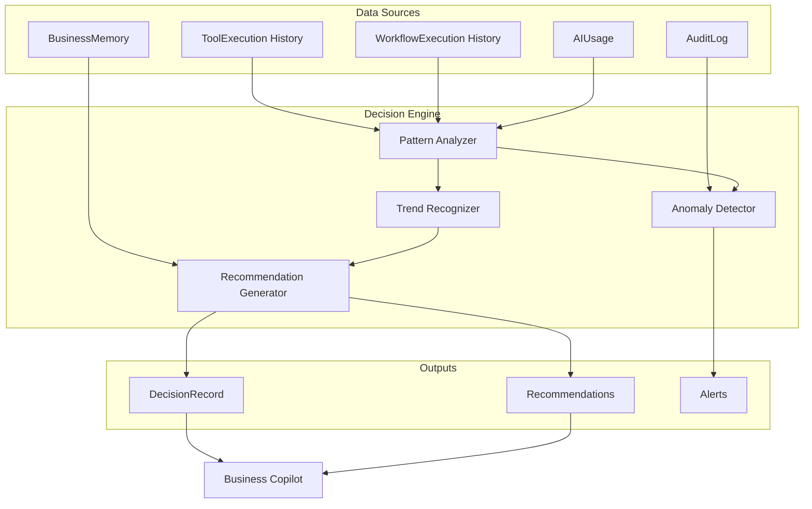

# ProTools Hub — Documentación Oficial

## Documento 17 — Decision Engine

> **Estado: DISEÑO — No implementado en el MVP**
> 
> Este documento describe el diseño del Decision Engine como referencia para la Fase 2 del desarrollo. Ningún código de este documento existe actualmente en el codebase.

---

**Versión del documento:** 1.0  
**Fecha:** 2026-06-29  
**Clasificación:** Design Doc — Fase 2

---

## Tabla de Contenidos

1. [Visión](#1-visión)
2. [Problema que Resuelve](#2-problema-que-resuelve)
3. [Arquitectura Propuesta](#3-arquitectura-propuesta)
4. [Tipos del Sistema](#4-tipos-del-sistema)
5. [Integración con el Sistema Existente](#5-integración-con-el-sistema-existente)
6. [Casos de Uso](#6-casos-de-uso)
7. [Consideraciones de Implementación](#7-consideraciones-de-implementación)

---

## 1. Visión

El **Decision Engine** es el motor que transforma los datos históricos de la plataforma en decisiones accionables. En lugar de mostrar datos al usuario y esperar que interprete, el Decision Engine analiza patrones, detecta anomalías y genera recomendaciones con justificación.

**Posición en la arquitectura:**

```
Analytics Data → Decision Engine → Recommendations → Copilot → User
```

El Decision Engine es el "cerebro analítico" que alimenta al Business Copilot con insights basados en datos históricos, no solo en el perfil de empresa.

---

## 2. Problema que Resuelve

### Sin Decision Engine (MVP actual)

El Copilot genera planes basándose en:
- El perfil estático de la empresa (Business Memory)
- El objetivo del usuario (Intent Engine)
- El catálogo de herramientas (Planning Engine)

Pero no considera:
- ¿Qué herramientas ha usado esta empresa y con qué resultados?
- ¿Qué workflows han fallado y por qué?
- ¿Hay patrones estacionales en el uso?
- ¿Qué herramientas tienen alta tasa de error en este sector?

### Con Decision Engine

El sistema aprende de los datos históricos y mejora sus recomendaciones:
- "Has ejecutado `iso9001-audit` 3 veces este trimestre. ¿Es momento de revisar acciones correctivas?"
- "Tu workflow de ventas tiene una tasa de fallo del 30% en el paso `crm-leads`. El problema está en el campo `email`."
- "Empresas similares a la tuya (sector tech, tamaño mediana) usan `content-plan` en Q4."

---

## 3. Arquitectura Propuesta



---

## 4. Tipos del Sistema

### DecisionRecord

```typescript
interface DecisionRecord {
  id:            string
  workspaceId:   string
  type:          DecisionType
  severity:      'info' | 'warning' | 'critical'
  title:         string         // "Alta tasa de fallo en iso9001-audit"
  description:   string         // Descripción detallada
  evidence:      Evidence[]     // Datos que soportan la decisión
  recommendation: string        // Acción recomendada
  actionType:    ActionType     // Tipo de acción sugerida
  actionData:    Json           // Datos para ejecutar la acción
  expiresAt:     DateTime       // Las decisiones tienen TTL
  createdAt:     DateTime
}

type DecisionType =
  | 'tool_performance'       // Rendimiento de una herramienta
  | 'workflow_failure'       // Fallo recurrente en un workflow
  | 'cost_anomaly'           // Coste IA inusualmente alto
  | 'usage_pattern'          // Patrón de uso detectado
  | 'missing_tool'           // Herramienta que debería estar instalada
  | 'objective_at_risk'      // Objetivo que no va a cumplirse
  | 'compliance_gap'         // Gap de cumplimiento detectado

type ActionType =
  | 'install_tool'
  | 'run_workflow'
  | 'review_execution'
  | 'update_objective'
  | 'add_risk'
  | 'none'
```

### Evidence

```typescript
interface Evidence {
  type:        'metric' | 'event' | 'comparison'
  description: string
  value:       number | string
  timestamp:   DateTime
}
```

---

## 5. Integración con el Sistema Existente

### Con Business Memory

El Decision Engine leerá el `BusinessContext` para personalizar recomendaciones:
- Una empresa con `regulations: ['ISO 9001']` recibirá decisiones de cumplimiento de calidad
- Una empresa con `digitalMaturity: 'emerging'` no recibirá recomendaciones de herramientas avanzadas

### Con Business Copilot

El Copilot incorporará los `DecisionRecord` activos en la fase `greeting`:

```typescript
// Nuevo campo en CopilotResponse
interface CopilotResponse {
  // ...campos existentes...
  activeDecisions: DecisionRecord[]  // Decisiones pendientes de acción
}
```

El mensaje de bienvenida del Copilot incluirá:
```
Tengo 2 insights importantes para ti:
⚠️ Tu workflow "Auditoría ISO" tiene una tasa de fallo del 30% esta semana
📈 Llevas 15 días sin ejecutar herramientas de Marketing
```

### Con el AuditLog

El Decision Engine leerá el AuditLog para detectar anomalías:
- Muchos eventos `permission.denied` → posible problema de roles
- Muchos eventos `rate_limit.exceeded` → usuario necesita mayor límite

---

## 6. Casos de Uso

### Caso 1: Detección de Fallo Recurrente

**Trigger:** 3+ ejecuciones de la misma herramienta con `status: FAILED` en 7 días

**DecisionRecord generado:**
```json
{
  "type": "tool_performance",
  "severity": "warning",
  "title": "Fallos recurrentes en 'Auditoría ISO 9001'",
  "description": "La herramienta ha fallado 4 veces esta semana. El error más común es: timeout en generación.",
  "recommendation": "Revisa la configuración de la herramienta o aumenta el límite de tokens.",
  "actionType": "review_execution",
  "actionData": { "toolInstanceId": "..." }
}
```

### Caso 2: Objetivo en Riesgo

**Trigger:** Objetivo con `dueDate` en 14 días y `progress < 50%`

**DecisionRecord generado:**
```json
{
  "type": "objective_at_risk",
  "severity": "warning",
  "title": "Certificación ISO 9001 en riesgo",
  "description": "Quedan 12 días para la fecha objetivo y el progreso es del 30%. Se necesitan ejecutar 4 herramientas más.",
  "recommendation": "Ejecuta el workflow de ISO ahora para completar el objetivo a tiempo.",
  "actionType": "run_workflow",
  "actionData": { "workflowId": "..." }
}
```

### Caso 3: Anomalía de Coste

**Trigger:** Coste IA hoy > 3x la media de los últimos 30 días

**DecisionRecord generado:**
```json
{
  "type": "cost_anomaly",
  "severity": "critical",
  "title": "Pico de consumo IA detectado",
  "description": "El coste de hoy (€2.45) es 4x la media diaria (€0.61). El modelo claude-opus-4-8 explica el 80% del coste extra.",
  "recommendation": "Revisa si hay ejecuciones inesperadas y considera usar claude-sonnet-4-6 para tareas rutinarias.",
  "actionType": "review_execution"
}
```

---

## 7. Consideraciones de Implementación

### Cuándo Ejecutar el Decision Engine

Opciones:
1. **On-demand:** Al abrir el Copilot — latencia visible pero sin carga de background
2. **Scheduled:** Job cada hora/día — datos siempre frescos pero background load
3. **Híbrido (recomendado):** Job diario + on-demand al abrir Copilot (solo si no hay cache reciente)

### Almacenamiento de Decisiones

Nueva tabla propuesta:
```prisma
model DecisionRecord {
  id:              String   @id @default(cuid())
  workspaceId:     String
  type:            String
  severity:        String
  title:           String
  description:     String
  evidence:        Json
  recommendation:  String
  actionType:      String
  actionData:      Json
  isActioned:      Boolean  @default(false)
  expiresAt:       DateTime
  createdAt:       DateTime @default(now())
  
  workspace Workspace @relation(...)
  
  @@index([workspaceId, expiresAt])
  @@index([severity, isActioned])
}
```

### Requisito de Datos Mínimos

El Decision Engine necesita al menos:
- 7 días de historial de `ToolExecution`
- Al menos 10 ejecuciones en el workspace

Sin datos suficientes, no genera decisiones.

### Privacidad

Las decisiones son **per-workspace**, no cross-workspace. El engine no comparte patrones entre organizaciones.
