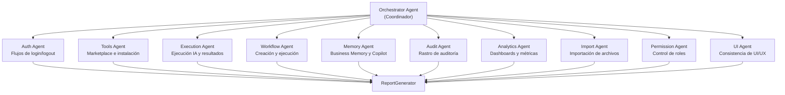

# ProTools Hub — Documentación Oficial

## Documento 19 — QA Sentinel

---

**Versión del documento:** 1.0  
**Fecha:** 2026-06-29  
**Estado:** Publicado  
**Ruta del proyecto:** `C:\Users\priet\flexidrop-qa-sentinel\`

---

## Tabla de Contenidos

1. [Qué es el QA Sentinel](#1-qué-es-el-qa-sentinel)
2. [Arquitectura Multi-Agente](#2-arquitectura-multi-agente)
3. [Los 10 Agentes de QA](#3-los-10-agentes-de-qa)
4. [Integración con ProTools Hub](#4-integración-con-protools-hub)
5. [Ejecución y Configuración](#5-ejecución-y-configuración)
6. [Modo Read-Only](#6-modo-read-only)

---

## 1. Qué es el QA Sentinel

El **QA Sentinel** es un sistema de detección automática de bugs en ProTools Hub. Vive en un repositorio separado (`flexidrop-qa-sentinel`) y se ejecuta contra la aplicación de forma independiente.

**Características principales:**
- Sistema multi-agente con 10 agentes especializados
- Basado en TypeScript + Playwright
- **Read-only**: nunca modifica datos de producción, solo lee y reporta
- Detección proactiva antes de que lleguen a QA manual
- Genera reportes de cobertura y calidad

**Tecnologías:** TypeScript, Playwright, sistema de agentes personalizado

---

## 2. Arquitectura Multi-Agente



El **Orchestrator Agent** coordina la ejecución de los 10 agentes, gestiona la prioridad y agrega los resultados en un reporte final.

---

## 3. Los 10 Agentes de QA

### Agent 1: Auth Agent

**Responsabilidad:** Flujos de autenticación

Pruebas:
- Login con email/contraseña
- Login con SSO/OAuth
- Registro de nuevo usuario
- Logout
- Protección de rutas privadas (intento de acceso sin auth)
- Redirección post-login a la ruta original

---

### Agent 2: Tools Agent

**Responsabilidad:** Marketplace e instalación de herramientas

Pruebas:
- Carga del marketplace (`/tools`)
- Búsqueda por keyword
- Filtros por categoría
- Instalación de herramienta
- Fork de herramienta
- Marcar favorito
- Compartir herramienta (toggle shareEnabled)

---

### Agent 3: Execution Agent

**Responsabilidad:** Ejecución IA y resultados

Pruebas:
- Ejecución de herramienta con campos completos
- Ejecución con campos opcionales vacíos
- Manejo de rate limit
- Visualización del resultado markdown
- Historial de ejecuciones
- Re-ejecución desde historial

---

### Agent 4: Workflow Agent

**Responsabilidad:** Creación y ejecución de workflows

Pruebas:
- Crear workflow desde cero
- Añadir nodo al canvas
- Conectar dos nodos
- Configurar variable global
- Ejecutar workflow
- Ver resultados por nodo
- Historial de ejecuciones del workflow

---

### Agent 5: Memory Agent

**Responsabilidad:** Business Memory y Copilot

Pruebas:
- Apertura del Copilot (`/copilot`)
- Envío de mensaje inicial
- Transición de fases (understanding → planning)
- Selección de plan
- Generación de workflow
- Actualización de perfil de empresa
- Creación de objetivo

---

### Agent 6: Audit Agent

**Responsabilidad:** Rastro de auditoría

Pruebas:
- Visualización del timeline de auditoría
- Filtros por acción y entidad
- Acceso con rol VIEWER (debe ser denegado)
- Acceso con rol ADMIN (debe funcionar)
- Presencia de entradas después de acciones conocidas

---

### Agent 7: Analytics Agent

**Responsabilidad:** Dashboards de métricas

Pruebas:
- Carga de la página de analytics
- Cambio de rango temporal
- Carga de la página de uso (usage)
- Métricas de tokens y coste
- Acceso con permisos correctos

---

### Agent 8: Import Agent

**Responsabilidad:** Importación de archivos

Pruebas:
- Subida de archivo CSV
- Subida de archivo Excel
- Subida de archivo PDF
- Subida de archivo DOCX
- Validación de formato incorrecto
- Generación de ToolDefinition desde import

---

### Agent 9: Permission Agent

**Responsabilidad:** Control de roles y permisos

Pruebas:
- VIEWER no puede instalar herramientas (espera 403)
- OPERATOR puede ejecutar pero no crear
- EDITOR puede crear workflows
- ADMIN puede ver analytics
- Acceso a workspace de otra organización (espera 404)

---

### Agent 10: UI Agent

**Responsabilidad:** Consistencia de UI y experiencia de usuario

Pruebas:
- WorkspaceShell presente en todas las páginas del workspace
- Sin elementos `<main>` duplicados dentro del shell
- Sin `<header>` dentro del shell (excepto `/tools`)
- Estilos de loading states correctos
- Responsive design en mobile (375px)
- Dark mode consistente

---

## 4. Integración con ProTools Hub

El QA Sentinel se ejecuta contra una instancia de ProTools Hub (dev, staging o prod):

```typescript
// config.ts
export const QA_CONFIG = {
  baseUrl:        process.env.QA_BASE_URL ?? 'http://localhost:3002',
  testUser:       { email: '...', password: '...' },
  testWorkspace:  process.env.QA_WORKSPACE_ID,
  timeout:        30_000,  // 30 segundos por test
}
```

El sistema usa **Playwright** para controlar el navegador y verificar estados de la UI y las API.

---

## 5. Ejecución y Configuración

```bash
# Instalar dependencias
cd C:\Users\priet\flexidrop-qa-sentinel
npm install

# Ejecutar todos los agentes
npm run qa:all

# Ejecutar un agente específico
npm run qa:auth
npm run qa:tools
npm run qa:execution

# Modo verbose (logs detallados)
npm run qa:all -- --verbose

# Generar reporte HTML
npm run qa:report
```

### Variables de Entorno

```bash
QA_BASE_URL=http://localhost:3002   # URL de la aplicación
QA_TEST_EMAIL=qa@example.com       # Email del usuario de prueba
QA_TEST_PASSWORD=...               # Contraseña del usuario de prueba
QA_WORKSPACE_ID=...                # Workspace de prueba
QA_ANTHROPIC_KEY=...               # Para tests de ejecución IA
```

---

## 6. Modo Read-Only

**Crítico:** El QA Sentinel está diseñado en modo **read-only** para entornos de producción.

En modo read-only:
- Los agentes **leen y verifican** datos existentes
- Los agentes **no crean, modifican ni eliminan** datos
- Las ejecuciones de IA usan un flag `QA_DRY_RUN=true` que devuelve resultados simulados

En modo dev:
- Los agentes pueden crear datos de test
- Los datos de test se marcan con el flag `isTestData: true` para limpieza posterior
- Al finalizar, se ejecuta el cleanup de datos de test

```typescript
// Ejemplo de agente en modo read-only
class AuthAgent extends BaseQAAgent {
  async run(): Promise<AgentResult> {
    if (this.config.readOnly) {
      // Solo verificar que el login form existe
      await this.page.goto('/sign-in')
      await this.expect.toHaveSelector('input[type="email"]')
      return { status: 'pass', tests: 1 }
    }
    
    // Modo dev: ejecutar el flujo completo
    // ...
  }
}
```
